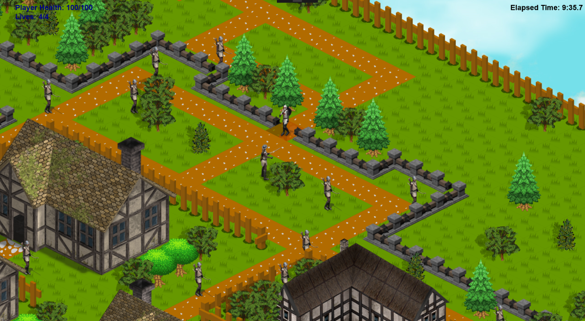

# IsometricGameUWP - C++ Universal Windows

A 2D isometric game written in C++ Universal Windows Platform with Win2D using a custom 2D game engine that was written for C++ UWP by my old professor, Charles Kelly.
(Check near the bottom of README to view extra information about the engine and this project)

Made as a final project in **Winter 2017** for my Beginning Game Programming course. Professor Charles Kelly had part of the engine started at the beginning
of the semester and by the end of the semester we were required to make a simple game using the features added into in the engine during the semester. 
  * Referring to a couple pieces of old code from his old game engine written in C++ and DX9 at the beginning of the semester and the features
  implemented in the engine during the semester, I was able to create a functioning Isometric game that ran on Windows 10. 
  
    * ***NOTES***: 
      * This application is not currently being worked on. Once I get the updated engine I will update the repo
      * This application also runs on the Xbox One but is not fully playable due to missing features in the engine
      * This game is not 100% complete due to the time restraint of the semester project being due and missing features in 
      the game engine

### Screenshots

##### Part of the isometric map. Players position is highlighted:

##### To get the win screen, the player needs to make it to the chest at the bottom corner before losing all their lives:

### Prerequisites

* Requires *Visual Studio 2017 or higher* to run the application.

* Requires your Windows 10 machine to be in *Developer Mode*

* Requires the Universal Windows Platform tools to be downloaded for Visual Studio (C++, but both C# and C++ won't hurt)

* Win2D Nuget Package

## Built With

* C++ Universal Windows Platform
* Win2D
* Custom C++ 2D UWP Game Engine by *Charles Kelly*

### Notes About the Project

### Information About the Engine

* *Professor Charles Kelly* originally wrote a 2D Game Engine in C++ and DX9. The website link is: http://programming2dgames.com/
and the link to the forum is on the left-hand side. Check-in there for updates on the newest version of the engine 
* Due to C++ and DX9 being out of date, it's recommended to use the C++ 2D UWP Game Engine once released
* In this version of the game engine and specific application, XAML had not been tested to write a User Interface for a game. It was written
using a custom class written for the game engine by the professor
  * Any type of menu should probably be written in XAML
* The version of this engine is incomplete

## Contributing

[Coming Soon]

## Authors

* **Hunter** - *Initial work* - [hjohnson012](https://github.com/hjohnson012)

See also the list of [contributors](https://github.com/hjohnson12/IsometricGameUWP/graphs/contributors) who participated in this project.

## License

This project is licensed under the MIT License - see the [LICENSE.md](LICENSE.md) file for details
